# 🚦 SatApp


**SatApp** es una aplicación móvil construida con **Expo + React Native + TypeScript** para ayudar a ciudadanos a consultar, entender y gestionar papeletas de tránsito asociadas al SAT de Lima.

La idea central es simple:

```text
Consultar → Entender → Revisar fechas → Decidir → Actuar → Seguir
```

El prototipo está pensado para personas no técnicas, especialmente usuarios de **35 a 55 años**, adultos mayores o personas que no están familiarizadas con trámites digitales. Por eso prioriza textos cortos, botones grandes, navegación visible, entradas guiadas, lectura por voz y flujos paso a paso.

---

## 🔗 Links importantes

> Estos enlaces son temporales y están listos para que luego reemplaces la URL real.

| Recurso | Link |
|---|---|
| 🎥 Video demo en YouTube | [Ver presentación de SatApp](https://youtu.be/REEMPLAZAR_VIDEO_DEMO) |
| 📦 APK para instalar | [Descargar APK desde Google Drive](https://drive.google.com/file/d/REEMPLAZAR_ID_DEL_APK/view?usp=sharing) |
| 🧠 Backend RAG | [`eduardo202020/sat-rag`](https://github.com/eduardo202020/sat-rag) |

---

## 🎯 Problema que resuelve

Una papeleta puede ser difícil de entender para una persona común:

- no siempre queda claro qué significa el código de infracción;
- los descuentos dependen de fechas y plazos;
- el usuario no sabe si conviene pagar, reclamar o esperar;
- los canales oficiales pueden sentirse dispersos;
- cuando la papeleta aún no aparece en el sistema, el usuario queda sin una ruta clara.

SatApp ordena esa información en una experiencia más humana: muestra el caso, explica qué ocurrió, calcula ventanas de beneficio, permite preparar descargos, registra seguimiento y guía al usuario sin saturarlo.

---

## ✨ Diferenciales del prototipo

- 🧭 **Flujo guiado:** la app no muestra todo a la vez; separa consulta, explicación, evidencia, fechas, opciones y pago.
- 🔡 **Inputs por carácter:** placa, DNI y código de infracción se ingresan en cajas individuales para reducir errores.
- 🗓️ **Calendario de descuentos:** visualiza días hábiles, fines de semana y tramos de beneficio con colores.
- 🔊 **Ayuda por voz:** algunas pantallas pueden leer la explicación para usuarios que prefieren escuchar.
- 🎙️ **Consulta por voz:** el usuario puede hablar y recibir una transcripción orientativa.
- 📎 **Descargo con sustento:** permite adjuntar fotos, PDF o documentos.
- 💳 **Pago interno prototipo:** simula pago con Yape sin sacar al usuario al navegador.
- 📱 **Diseño simple:** botones grandes, textos directos, navegación inferior con tres accesos principales.

---

## 🧩 Navegación principal

La app usa una navegación inferior con tres accesos:

| Tab | Función |
|---|---|
| 🧳 **Casos** | Retomar papeletas consultadas o registradas. |
| 🏠 **Inicio** | Punto de partida para consultar, usar voz o revisar una papeleta. |
| ❓ **Ayuda** | Guía simple para aprender a usar la app. |

El drawer queda como menú secundario para:

- 👤 Perfil;
- 🏢 Canales oficiales SAT;
- 🟢 WhatSAT.

---

## 📲 Pantallas de la app

Las capturas están versionadas en [`docs/pantallas`](docs/pantallas/). Cada pantalla cumple una responsabilidad concreta para evitar duplicar información y no abrumar al usuario.

### 1. Inicio


Pantalla de entrada con accesos directos a las acciones más importantes: consultar papeleta, consultar por voz, entender una papeleta y revisar descuentos. El objetivo es que el usuario no tenga que aprender la app antes de usarla.

### 2. Menú lateral

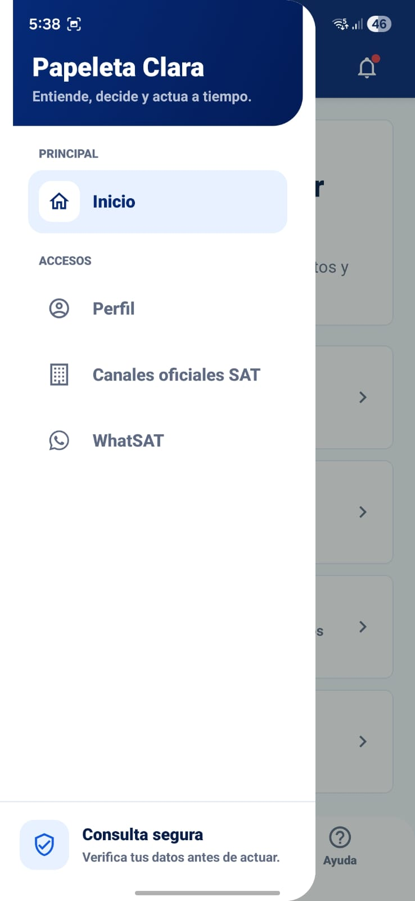

Drawer simplificado con pocas opciones. Se mantiene como navegación secundaria para no competir con los tres tabs principales.

### 3. Consulta guiada

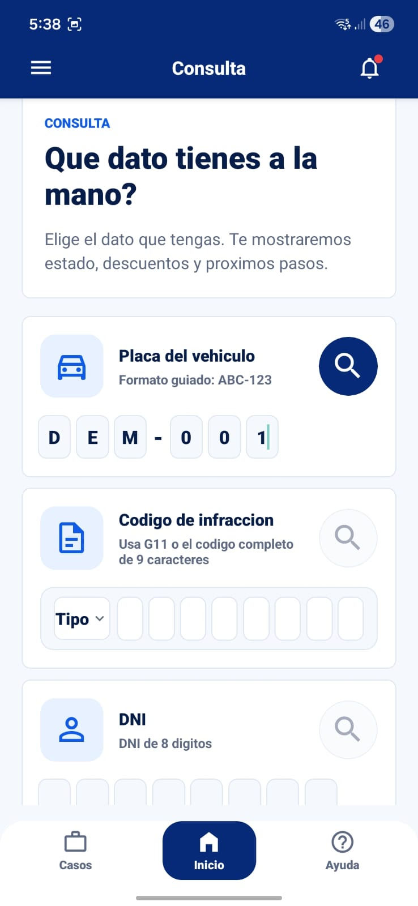

Permite buscar usando solo un dato: placa, código de infracción o DNI. Los campos se completan por carácter, con formato guiado y teclados adecuados para reducir errores de digitación.

### 4. Detalle del caso

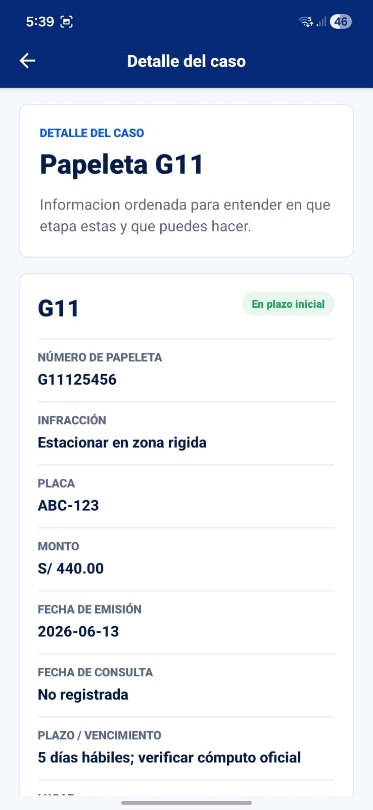

Resume la papeleta con información esencial: código, número, infracción, placa, monto, fecha, vencimiento, riesgo y estado. Desde aquí se abre cada flujo especializado.

### 5. Evidencia

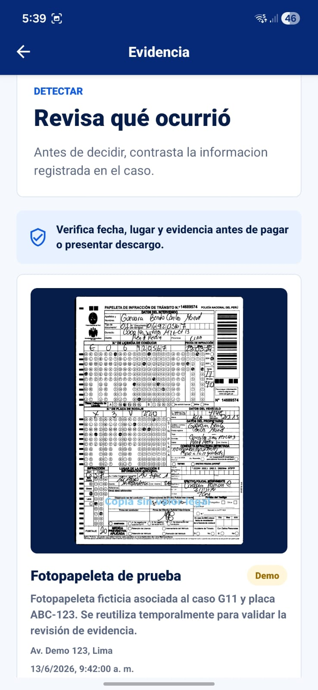

Sirve para contrastar la información registrada antes de pagar o presentar descargo. En el prototipo muestra una fotopapeleta de prueba.

### 6. Entender mi situación

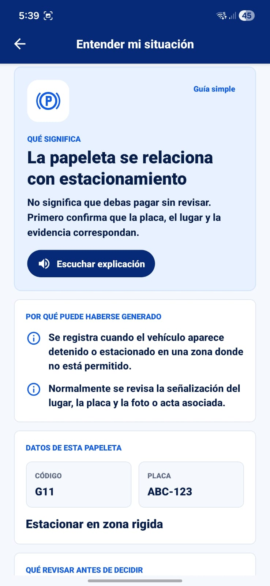

Explica la papeleta en lenguaje ciudadano: qué significa, por qué pudo generarse y qué datos revisar. Esta pantalla evita repetir fechas o pagos; su foco es comprensión.

### 7. Línea de tiempo: calendario

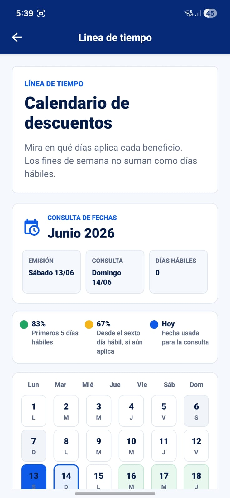

Muestra fecha de emisión, fecha de consulta, días hábiles transcurridos y calendario mensual. Los colores ayudan a entender cuándo aplica cada beneficio.

### 8. Línea de tiempo: beneficio

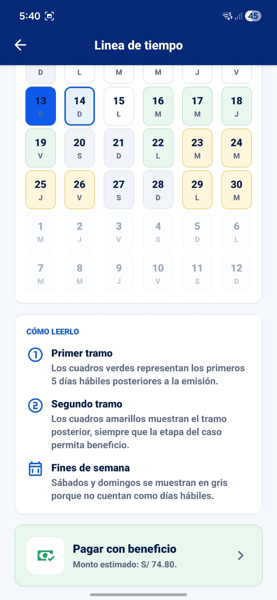

Explica cómo leer el calendario y ofrece una acción directa para pagar con beneficio cuando corresponde.

### 9. Selección de pago

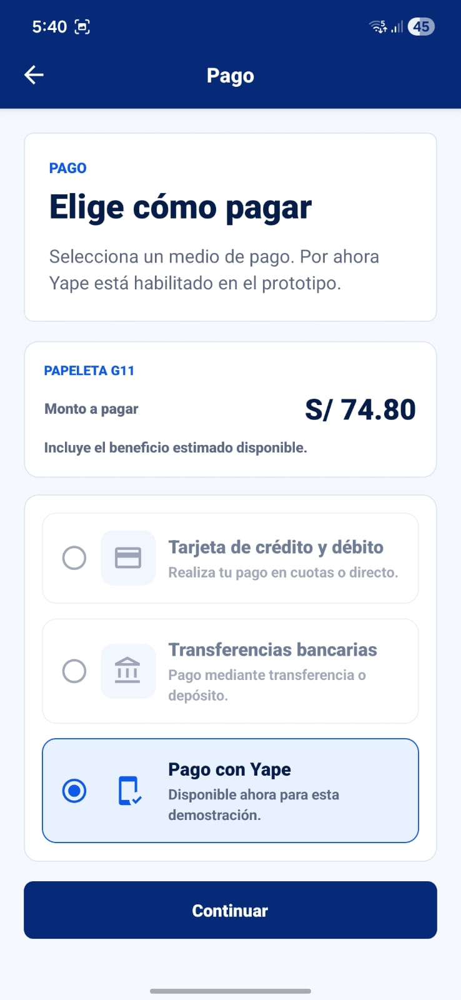

Presenta métodos de pago de forma clara. Por ahora, Yape es el método habilitado dentro del prototipo; los demás quedan como ruta futura.

### 10. Pago con Yape

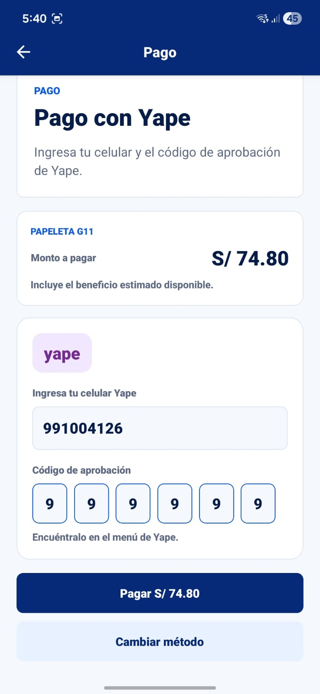

Simula el ingreso de celular y código de aprobación de Yape. Mantiene al usuario dentro de la app para que el flujo sea continuo.

### 11. Pago registrado

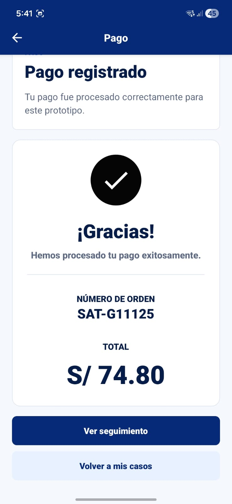

Muestra confirmación, número de orden y total pagado. Desde aquí se puede ir a seguimiento o volver a los casos.

### 12. Opciones y descuento

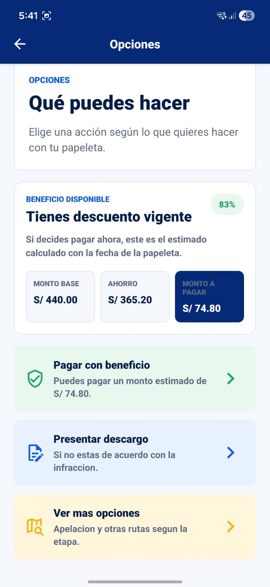

Ayuda a decidir entre pagar con beneficio, presentar descargo o revisar otras opciones. Resume monto base, ahorro y monto estimado a pagar.

### 13. Preparar descargo

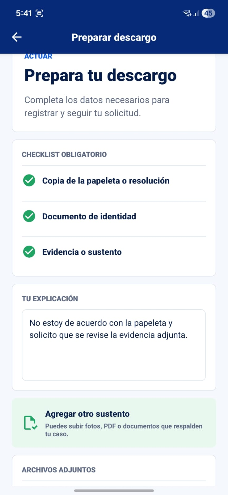

Permite marcar checklist, escribir explicación y adjuntar sustento. Acepta fotos, PDF y documentos mediante `expo-document-picker`.

### 14. Mis casos

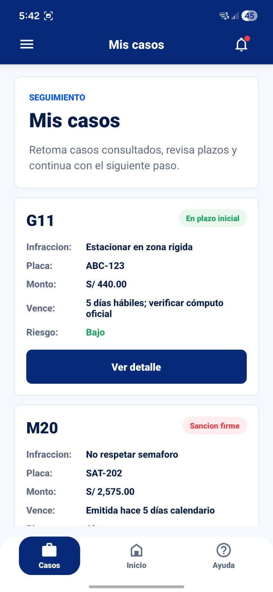

Lista las papeletas asociadas o registradas por el usuario para retomar el seguimiento, revisar plazos y entrar al detalle.

---

## 🧪 Datos de prueba

Para probar el flujo local de la app:

| Dato ingresado | Resultado esperado |
|---|---|
| `ABC123` o `ABC-123` | Caso G11 con descuento |
| `G11` o `G11125456` | Caso G11 |
| `45678901` | Casos asociados a ese DNI |
| `SAT202` o `M20078901` | Caso M20 |
| `LIM046` o `G46654321` | Caso G46 |

Datos disponibles desde `sat-rag`:

| Placa | Código | Caso |
|---|---|---|
| `DEM001` | `G11` | `demo-g11-descuento` |
| `DEM002` | `G27` | `demo-g27-plazo-proximo` |
| `DEM003` | `M03` | `demo-m03-sancion-firme` |
| `DEM005` | `G27` | `demo-g27-segunda-ventana` |
| `DEM004` | `M42` | `demo-m42-riesgo-coactivo` |

---

## 🗣️ Consulta por voz

La consulta por voz usa `expo-speech-recognition` y sigue una interacción inspirada en notas de voz:

- grabar con micrófono;
- ver contador;
- observar onda dinámica;
- pausar;
- cancelar;
- enviar;
- transcribir;
- usar el texto para orientar el flujo.

Esta función ayuda a usuarios que no quieren escribir o que se sienten más cómodos explicando su caso hablando.

---

## 🧠 Relación con sat-rag

SatApp puede consumir el backend [`eduardo202020/sat-rag`](https://github.com/eduardo202020/sat-rag) mediante:

```bash
EXPO_PUBLIC_SAT_API_URL=http://IP_DE_TU_PC:8000
```

Importante: si pruebas desde un teléfono físico, no uses `localhost` ni `127.0.0.1` dentro de la app. Usa la IP LAN de tu PC/WSL o una URL pública.

La app consume principalmente:

- `GET /cases`
- `GET /cases/{case_id}`
- `GET /cases/{case_id}/tracking`
- `POST /cases/{case_id}/actions`
- `POST /diagnostico-claro`

Si el backend no está disponible, la app conserva datos locales para que el prototipo siga navegable.

---

## 🏗️ Estructura del proyecto

```text
app/
  (drawer)/
    (tabs)/
      casos/
      inicio/
      ayuda/
    perfil/
  alertas/
  caso/[id]/
  papeleta/[id].tsx

src/
  features/
    alerts/
    cases/
    help/
    profile/
    ruta-clara/
    voice/
  shared/
    api/
    components/
    data/
    hooks/
    navigation/
    styles/
    types/

docs/
  pantallas/
```

---

## ⚙️ Stack técnico

- Expo SDK 54.
- React Native 0.81.
- React 19.
- TypeScript.
- Expo Router.
- React Navigation Drawer.
- Expo Dev Client.
- EAS Build.
- `expo-speech-recognition` para consulta por voz.
- `expo-speech` para lectura en voz alta.
- `expo-image-picker` para foto de papeleta.
- `expo-document-picker` para sustento de descargo.
- `expo-splash-screen` para splash/icono.

---

## 🚀 Desarrollo local

Instalar dependencias:

```bash
npm install
```

Verificar TypeScript:

```bash
npm run typecheck
```

Iniciar Metro para development build:

```bash
npm run start:dev:tunnel -- --clear
```

En WSL2 con teléfono físico, el modo tunnel suele ser el más estable.

---

## 📦 Builds

APK con development client para seguir desarrollando:

```bash
npx eas build --platform android --profile development
```

APK preview para compartir:

```bash
npx eas build --platform android --profile preview
```

Después de instalar un development build, los cambios JS/TS/estilos pueden verse con Metro sin generar otro APK.

Requieren nuevo build:

- nuevas librerías nativas;
- permisos;
- plugins Expo;
- icono;
- splash;
- configuración Android/iOS.

---

## 🧭 Guion sugerido para el video demo

1. Mostrar Inicio y explicar que la app resume el trámite en acciones simples.
2. Consultar una papeleta por placa, DNI o código.
3. Abrir el detalle y revisar los datos principales.
4. Entrar a Evidencia para verificar la fotopapeleta.
5. Abrir Entender mi situación y usar la explicación por voz.
6. Revisar Línea de tiempo para ver descuentos por fecha.
7. Entrar a Opciones y elegir pagar con beneficio.
8. Completar el flujo de pago con Yape.
9. Mostrar Mis casos para continuar seguimiento.
10. Mencionar que también existe descargo con archivos adjuntos.

---

## 🔐 Privacidad y alcance

El prototipo usa datos ficticios. No debe usarse con datos personales reales sin consentimiento, controles de seguridad y validación legal.

SatApp no reemplaza canales oficiales del SAT ni constituye asesoría legal. Su objetivo es orientar, ordenar información y ayudar al usuario a decidir el siguiente paso.

---

## 🛣️ Próximas mejoras

- Persistir registros manuales y preferencias.
- Mejorar autenticación y perfil.
- Conectar pagos reales solo con proveedor autorizado.
- Agregar recordatorios locales por fecha.
- Integrar feriados para cómputo de días hábiles.
- Robustecer privacidad antes de usar datos reales.
- Convertir la ayuda en onboarding o tour guiado si el alcance lo permite.
