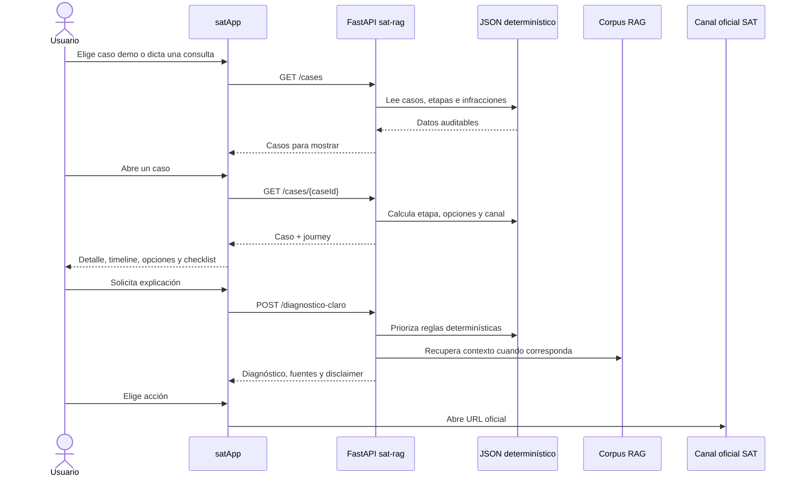

# Primera visión end-to-end

## Objetivo

Conectar la experiencia móvil de `satApp` con la base de conocimiento y reglas de
`sat-rag` sin permitir que un modelo generativo decida plazos, riesgos, descuentos o
canales oficiales.

```text
Usuario -> satApp -> FastAPI sat-rag -> reglas JSON + corpus RAG -> satApp -> canal SAT
```

## Responsabilidades

### satApp

- Captura el punto de partida del usuario: navegación, dato disponible o voz.
- Presenta casos, etapas, riesgos, opciones, checklist y canales.
- No calcula reglas legales.
- Usa datos locales ficticios como respaldo cuando FastAPI no está disponible.

### sat-rag

- Es la fuente de verdad para casos demo, etapas, reglas, infracciones y canales.
- Expone un contrato FastAPI orientado a la experiencia de usuario.
- Recupera contexto normativo y conserva referencias de fuente.
- Marca información que requiere validación manual.

## Flujo de usuario inicial



## Contrato implementado

| Pantalla o capacidad | Endpoint | Estado |
|---|---|---|
| Lista de casos | `GET /cases` | Conectado con respaldo local |
| Detalle del caso | `GET /cases/{caseId}` | Conectado |
| Línea de tiempo | `GET /cases/{caseId}` | Conectado |
| Opciones disponibles | `GET /cases/{caseId}` | Conectado |
| Checklist | `GET /cases/{caseId}` | Conectado |
| Canal oficial | `GET /cases/{caseId}` | Conectado |
| Voz a caso demo | Detección local + casos API | Conectado |
| Diagnóstico explicado | `POST /diagnostico-claro` | API lista; falta pantalla |
| Pregunta RAG libre | `GET /rag/search` | API lista; falta experiencia UI |
| Consulta SAT real | Integración externa | Fuera del MVP actual |

## Ejecutar ambos proyectos

### 1. Backend

```powershell
cd C:\Users\pc\Documents\proyectos\SatApp\sat-rag
python -m venv .venv
.\.venv\Scripts\Activate.ps1
pip install -r requirements.txt
uvicorn api.main:app --reload --host 0.0.0.0 --port 8000
```

Swagger queda disponible en `http://127.0.0.1:8000/docs`.

### 2. Aplicación

Crear `.env` desde `.env.example`. Para un teléfono físico, reemplazar `127.0.0.1`
por la IP LAN de la computadora.

```powershell
cd C:\Users\pc\Documents\proyectos\SatApp\satApp
Copy-Item .env.example .env
npm run start:dev:tunnel -- --clear
```

## Decisiones de seguridad

- La app no envía audio; solo enviará texto transcrito cuando se conecte el diagnóstico.
- FastAPI redacta correos, teléfonos e identificadores largos del resumen narrativo.
- Los montos demo siguen marcados como ficticios.
- No se calculan fechas límite definitivas ni feriados.
- Las fuentes OCR y la tabla parcial de infracciones no deben convertirse automáticamente
  en reglas de producción.

## Siguiente corte vertical

La siguiente integración debe añadir una pantalla de diagnóstico que consuma
`POST /diagnostico-claro` y muestre:

- explicación simple;
- plazo con advertencia de cómputo;
- riesgo;
- acciones disponibles;
- fuentes;
- disclaimer;
- CTA hacia el canal oficial.
